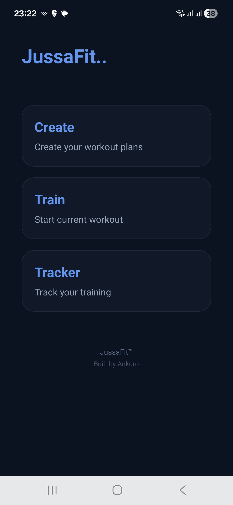
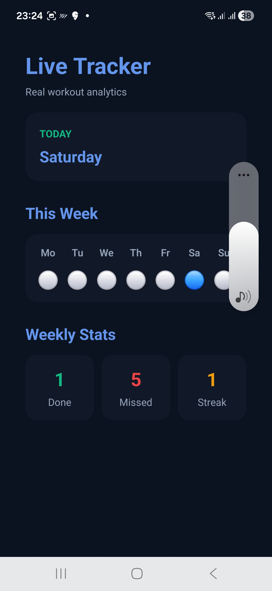
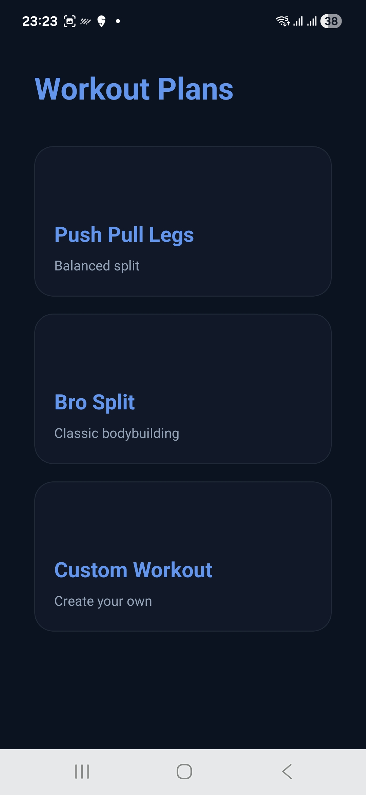
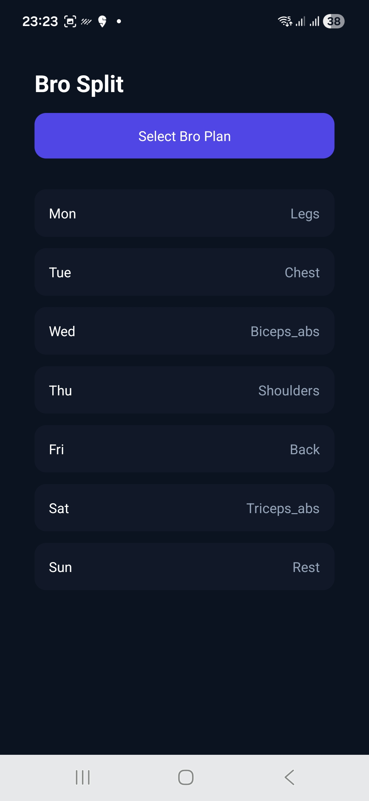
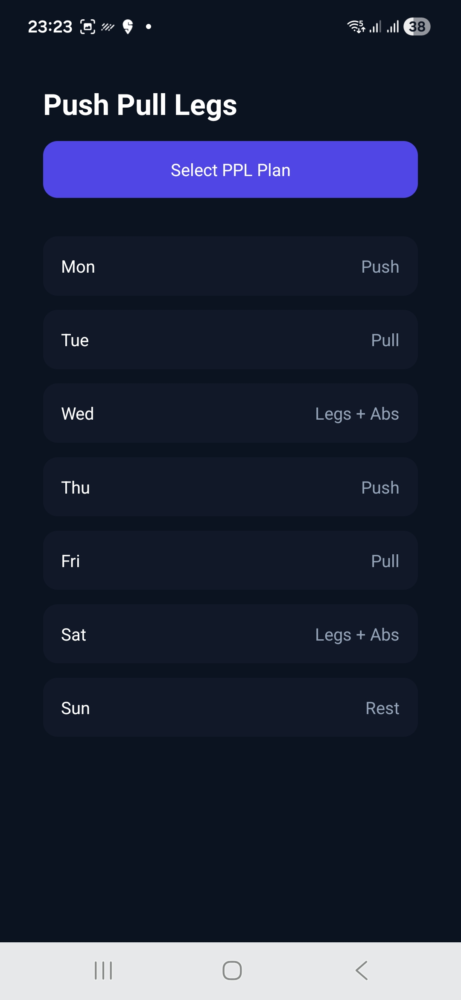
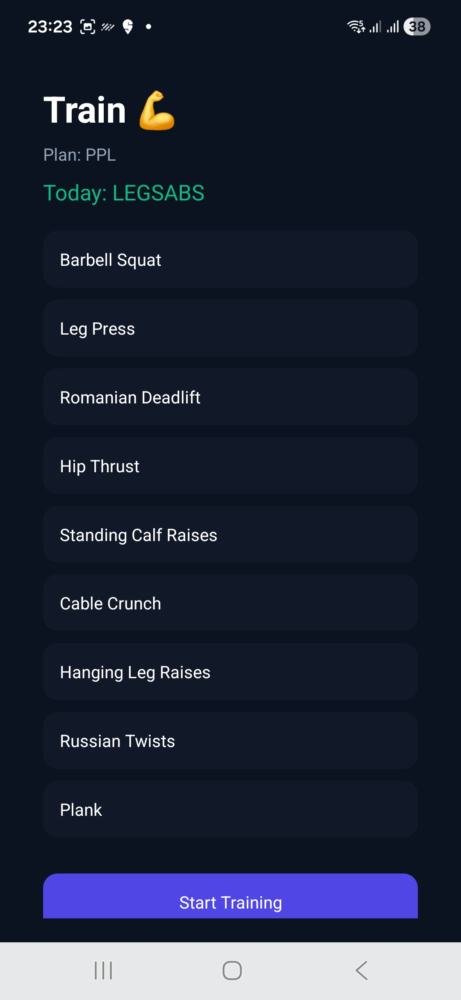
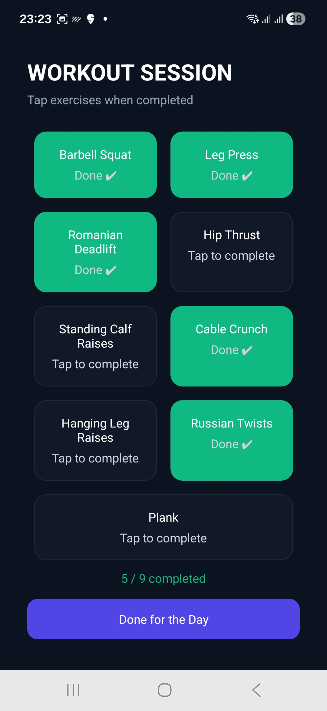
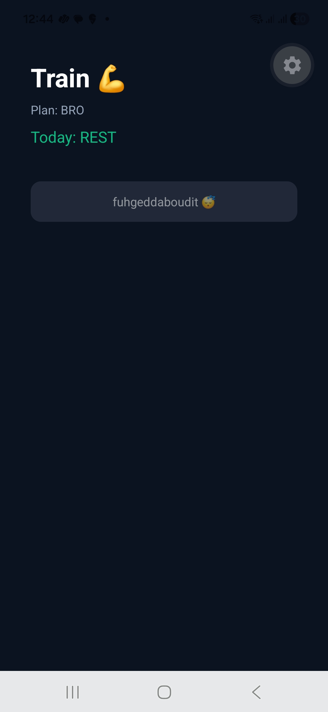

# 🏋️ JussaFit — Fitness Tracking Mobile App

A cross-platform fitness tracking application built using React Native (Expo) that helps users log workouts, track progress, and maintain fitness consistency.

## 📸 Screenshots

<p align="center">

### jussaFit


### Tracker


### Plan selecter


### Bro split


### Push pull legs


### Train


###  Workout


###  Rest day


</p>

---

## 📱 Live App
- Download / Run:
- Expo Go (development)
- Play Store (coming soon)

---

## ✨ Features

- 📊 Workout logging and tracking
- 🗓️ Daily/weekly fitness progress view
- 🔄 Real-time state updates for workout sessions
- 📱 Mobile-first responsive UI (Android/iOS via Expo)
- 🧾 Structured workout history tracking
- ⚡ Lightweight and fast performance

---

## 🏗️ Tech Stack

- **Frontend:** React Native (Expo)
- **Backend:** Node.js (basic API layer)
- **State Management:** React Hooks
- **Storage:** Local storage / lightweight persistence (expandable to DB)
- **Deployment:** Expo EAS Build

---

## 🧠 System Design Overview

The app is structured as a modular mobile client:

- UI Layer → React Native screens/components
- State Layer → Hooks-based state management
- Data Layer → Local persistence + API-ready structure
- Build Layer → Expo EAS for cross-platform builds

---

## 📦 Installation & Setup

```bash
git clone https://github.com/ankurvij13/fitlog1
cd fitlog1
npm install
npx expo start
